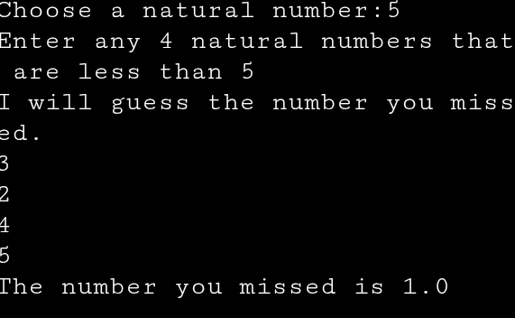

# Smart Number Guesser

This is a Python program where the computer tries to guess a number selected by the user.
## 📸 Example Output

## How it works
- The user thinks of a number within a range
- The computer makes a guess
- Based on user feedback correct number is guessed

## Features
- Dynamic range adjustment
- Interactive gameplay

## What I Learned
- Loops
- Handling user input
- Problem-solving using range-based logic

## How to Run
1. Run the Python file
2. Think of a number
3. Guide the computer with feedback
